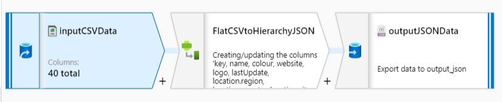

# AZDataFactories

## New features for SSIS in Data Factory
Data Factory has added the following features for SSIS:

Support for three more configurations/variants of Azure SQL Database to host the SSIS database (SSISDB) of projects/packages:
- SQL Database with virtual network service endpoints
- SQL Managed Instance
- Elastic pool
- Support for an Azure Resource Manager virtual network on top of a classic virtual network to be deprecated in the future, which lets you inject/join your Azure-SSIS integration runtime to a virtual network configured for SQL Database with virtual network service endpoints/MI/on-premises data access. For more information, see also Join an Azure-SSIS integration runtime to a virtual network.
- Support for Azure Active Directory (Azure AD) authentication and SQL authentication to connect to the SSISDB, allowing Azure AD authentication with your Data Factory managed identity for Azure resources
- Support for bringing your existing SQL Server license to earn substantial cost savings from the Azure Hybrid Benefit option
- Support for Enterprise Edition of the Azure-SSIS integration runtime that lets you use advanced/premium features, a custom setup interface to install additional components/extensions, and a partner ecosystem. For more information, see also Enterprise Edition, Custom Setup, and 3rd Party Extensibility for SSIS in ADF.
- Deeper integration of SSIS in Data Factory that lets you invoke/trigger first-class Execute SSIS Package activities in Data Factory pipelines and schedule them via SSMS. For more information, see also Modernize and extend your ETL/ELT workflows with SSIS activities in ADF pipelines.

## Limitations

### Limit on the number of integration runtimes
There is no hard limit on the number of integration runtime instances you can have in a data factory. There is, however, a limit on the number of VM cores that the integration runtime can use per subscription for SSIS package execution. 

More on limit dtails can be seen at:
https://docs.microsoft.com/en-us/azure/azure-resource-manager/management/azure-subscription-service-limits#data-factory-limits

https://github.com/MicrosoftDocs/azure-docs/blob/master/includes/azure-data-factory-limits.md

# Specify an access tier for blob data
General-purpose v2 accounts support all Azure storage services and data objects, but access tiers are available only to block blobs within Blob storage. When we upgrade to a general-purpose v2 storage account, we can specify a default account access tier of hot or cool, which indicates the default tier our blob data will be uploaded as if the individual blob access tier parameter is not specified.

Blob access tiers enable us to choose the most cost-effective storage based on your anticipated usage patterns. Block blobs can be stored in a hot, cool, or archive tiers. For more information on access tiers can be found here: https://docs.microsoft.com/en-us/azure/storage/blobs/storage-blob-storage-tiers

By default, a new storage account is created in the hot access tier, and a general-purpose v1 storage account can be upgraded to either the hot or cool account tier. If an account access tier is not specified on upgrade, it will be upgraded to hot by default. If we are exploring which access tier to use for your upgrade, consider our current data usage scenario. There are two typical user scenarios for migrating to a general-purpose v2 account:

- we have an existing general-purpose v1 storage account and want to evaluate an upgrade to a general-purpose v2 storage account, with the right storage access tier for blob data.
- we have decided to use a general-purpose v2 storage account or already have one and want to evaluate whether we should use the hot or cool storage access tier for blob data.

In both cases, the first priority is to estimate the cost of storing, accessing, and operating on our data stored in a general-purpose v2 storage account and compare that against our current costs.

## Pricing & billing details can be found here: 
https://docs.microsoft.com/en-us/azure/storage/common/storage-account-upgrade?toc=%2Fazure%2Fstorage%2Fblobs%2Ftoc.json&tabs=azure-powershell

# Recover a deleted storage account
https://docs.microsoft.com/en-us/azure/storage/common/storage-account-recover?toc=/azure/storage/blobs/toc.json

## Trigger Ref:
https://docs.microsoft.com/en-us/azure/data-factory/how-to-create-schedule-trigger

##Event Based Trigger Properties
- @triggerBody().folderPath
- @triggerBody().fileName
- @endswith(item().name.'.csv')

